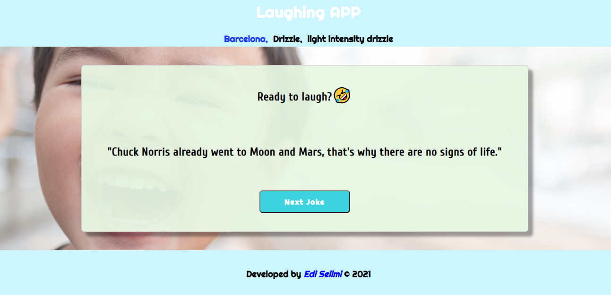

# Laughing APP

> This is a simple LaughingAPP.
Once you open the App you will be asked to give consent to access to your location.
Once given, the climatic conditions of your city will be shown and a button to load the jokes.
It consumes 3 APIs.


## Live Demo

[Live Site](https://laughingapp.netlify.app/)


## View:




## Getting started

```
Open index.html with your browser
```


## Built With

- HTML
- CSS
- JavaScript


## APIs

**Weather**
[Open Weather Map](https://openweathermap.org/)

**Jokes**
[Icndb](http://www.icndb.com/)
[Icanhazdadjoke](https://icanhazdadjoke.com/)


## Author

👤 **Author**
- GitHub: [@Edi10-developer](https://github.com/Edi10-developer)
- LinkedIn: [LinkedIn](https://www.linkedin.com/in/edi-selimi-856671173/?locale=en_US)
- Portfolio: [www.ediselimi.com](https://ediselimi.com/)


## Show your support

Contributions, issues, and feature requests are welcome!
Give a ⭐️ if you like this project!

## Acknowledgments

- Hat tip to anyone whose code was used
- Inspiration
- etc

